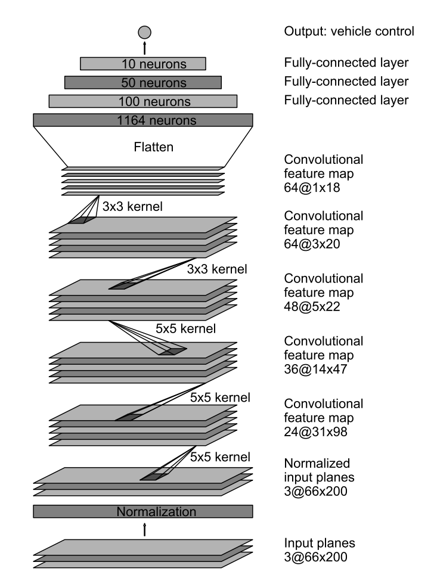

# Self-Driving Car Engineer Nanodegree
# Deep Learning
## Project: Behavorial Cloning

### Goal:
Use deep learning to teach a car how to drive using the simulator provided by Udacity.

### Dataset:
Although it is possible to generate data with the simulator, I wasn't able to drive the car well enough with my laptop keyboard to get good data. Therefore, I used the dataset provided by Udacity.
Dataset description: images from 3 different cameras placed at the center, left and right of the car and their associated steering angle, throttle and speed.

### Data cleansing:
Some points in the dataset were recorded with a very low speed. These may be outliers and I decided to remove them.

### Validation set:
In order to pick the best model and avoid overfitting, 10% of the training dataset was randomly selected for validation.

### Model description:
I implemented the model described in the NVIDIA paper (http://images.nvidia.com/content/tegra/automotive/images/2016/solutions/pdf/end-to-end-dl-using-px.pdf) in Keras. I used RGB images instead of converting them to YUV since RGB images gave better results.

I used a training generator from Keras in order to generate more random images from the dataset.
Used AdamOptimizer with learning rate of 10e-4.

I used checkpoint to save model weights after each epoch. 

### Data preparation:
- Resized the images to 60x200x3 since that's the expected input for the model.
The original dataset included 7k images.
My first try using center camera images only without additional data generation performed poorly. 
I then decided to generate additional data in this chronological order:
- Horizontal flip of the image and take the opposite of the steering angle.
- Translate the image horizontally by a random number of pixels from 0 to 50 pixels in each direction. For each translated pixel, I adjusted the steering angle by 0.008 degres. After trying different values of the adjustment factor from 0.001 to 0.01 degres per pixel, I chose 0.008 since it provided the best results.
- Use images from all 3 cameras and adjust the steering angle for left/right images. I've tried many different values for the adjustment factor, from 0.1 to 0.5. 0.3 was the adjustment angle that provided the best results.

### Model training:
I included 28k examples in each epoch
I ran the model for at most 10 epochs. I initially selected the model with the lowest validation loss. However, after noticing that some of my earlier models with less data generation had lower validation loss by performed worse on the track, I started to test the simulator for models at different epochs from the one with the lowest validation loss.

I was able to train the model locally on my MacBook Pro in less than 3 minutes per epoch, so 30 minutes total for 10 epochs.

Note: validation loss can be lower that the training loss because training includes more data transformation. Validation only includes the 3 cameras without data augmentation (i.e. no horizontal flipping, no random translation etc.). This choice was made so that I could compare the validation loss across different models.

### Other data generation tried that did not work:
- Change brightness
- Add image rotation
- Convert image to YUV space
None of these changes provided gains

### Observations:
More zigzags at higher speeds
Track 2: increased throttle to make the car go up the hill
Surprised at how picky the model is. A small adjustment in the parameters can make it work.
Some models have lower validation losses but perform poorly on the track.
Simulator not performing well when other applications are running as well (e.g. training another model)
Higher resolution
Higher quality
=> Generate random shadows?
